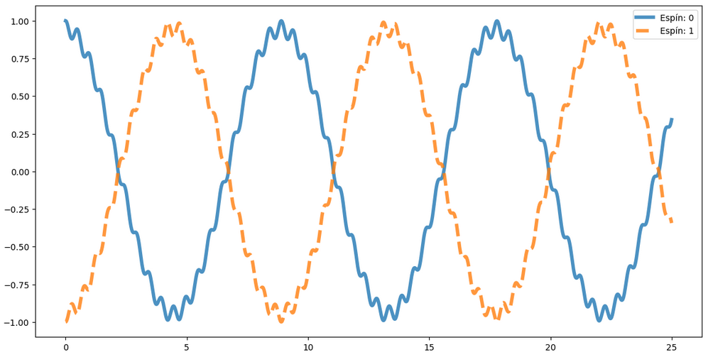
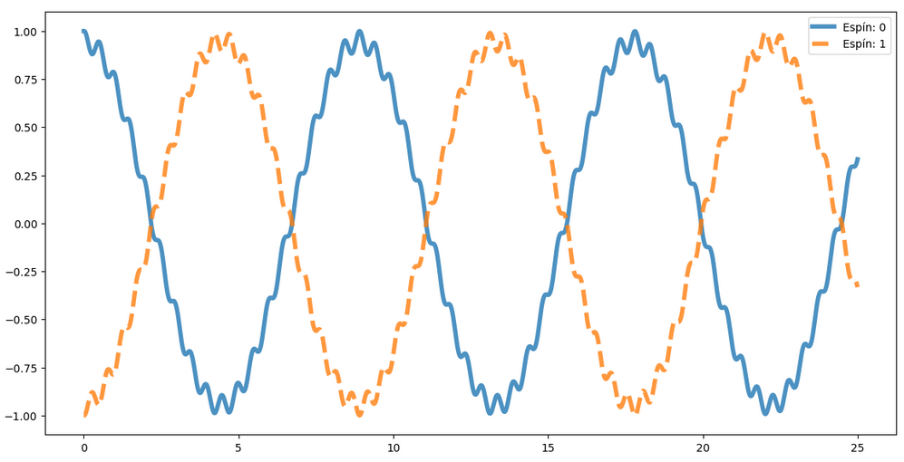

En esta sección se dará una breve explicación de los pasos que se siguieron, las funciones utilizadas, entre otras generalidades

### Bibliotecas
Para este proyecto se hizo uso de la biblioteca `numpy`, además se importó la biblioteca `Qutip` con la cual se obtuvieron las matrices de Pauli y permitió realizar los productos tensoriales entre los elementos de un arreglo.

### Hamiltoniano
Para construir el hamiltoniano del sistema se creó la función `hamiltonian` que depende de la cantidad de espines, primero se crean los vectores donde se guardarán las matrices de cada espín, mediante algunos `for` se crean matrices temporales donde se guardarán los elementos a operar colocando la matriz de Pauli en la posición para el espín correspondiente y llenando el resto con la matriz identidad. La matriz del espín será el resultado de aplicar el producto tensorial sobre todos los elementos de la matriz temporal.

Una vez obtenidas las matrices de espín se evalúan ambos términos del hamiltoniano haciendo ambas sumatorias con el cuidado de evaluar condiciones periódicas donde el último espín y el primer espín estén conectados. De la función se obtienen la matriz y el arreglo de las matrices de espín en la dirección $z$ que se utilizará más adelante

### Solución numérica de Schrodinger
Para obtener la solución numéricamente de la ecuación de Schrodinger se utilizó el método $\textit{Runge Kutta}$ de $4^{to}$ orden. Primero se definió un estado inicial, luego una función que devuelve la ecuación de Schrodinger y una función para el método $RK4$. Se llamó a la función `hamiltonian`, se estableció una grilla temporal y el paso de tiempo de esta. En un ciclo `for` se obtiene el valor de expectación del espín para el estado inicial y se guarda en un arrelo, aplicando $RK4$ se obtiene el siguiente estado que pasa a ser el inicial para calcular de nuevo el valor de expectación y sigue de esta forma hasta terminar el ciclo. Para visualizar los resultados se graficaron los valores de expectación de cada espín en función del tiempo.

Para el caso de dos espines se obtuvo el siguiente gráfico:

### Solución analítica con la exponencial
Con una función de `numpy` se diagonaliza el Hamiltoniano, luego se cambia de base la polarización en $z$ multiplicando cada matriz por la matriz de transformación a la izquierda y la transpuesta de la matriz de transformación por la derecha, y la base del estado inicial multiplicando la matriz de trasnformación por la derecha.

Se define una grilla temporal y un arreglo para los valores de expectación, se crea un sistema de ciclos `for` igual que el anterior con la diferencia que en lugar de llamar a $RK4$ para calcular el siguiente estado se crea un propagador que será la exponencial del $eigen valor$ obtenido de la diagonalización del Hamiltoniano y se aplica este propagador al estado inicial, el nuevo estado pasa a ser el inicial continúa el cálculo de valores de expectación.

De nuevo se puede ver el resultado graficando los valores de expectación en función del tiempo obteniendo el gráfico: 

### Paralelización

La paralelización del código Python se realizó utilizando la Intel Math Kernel Library (MKL) que consiste en una librería de funciones y rutinas optimizadas sobre matemática aplicada. MKL permite la optimización en algunos procesos llevados en Python pues las librerias mencionadas están escritas bajo el paradigma de C/C++ siendo más flexibles en cuanto a la utilización y manejo de hilos permitiendo el desarrollo de rutinas optimizadas que puedan ser implementadas en Python. Para este caso la incorporación se realiza a la biblioteca Numpy.

Para la paralelización se separaron ambos métodos (Runge-Kutta y Exponencial) y cambiando el número de hilos con una variable de ambiente se evalúo la aceleración de la optimización para ambos, además para el método Exponencial también se realizó una separación entre la optimización de la diagonalización del Hamiltoniano y la optimización sumandole la evolución en el tiempo.
 
