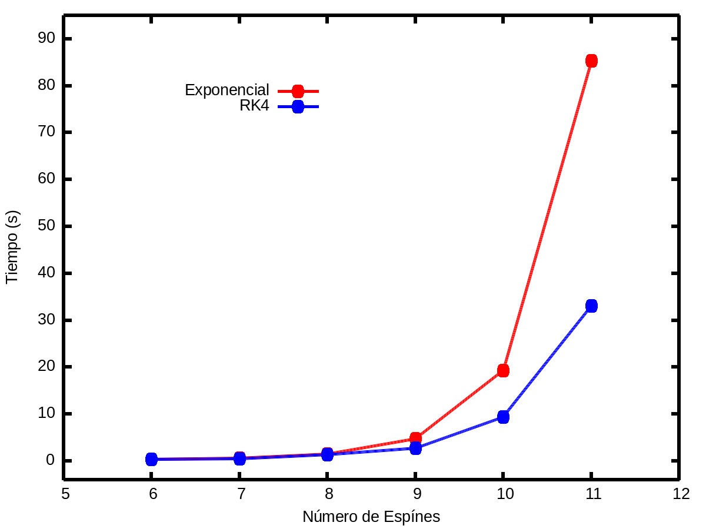
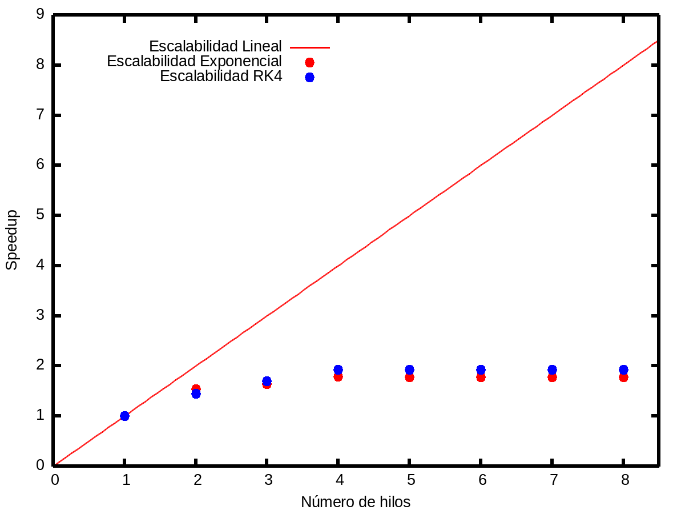
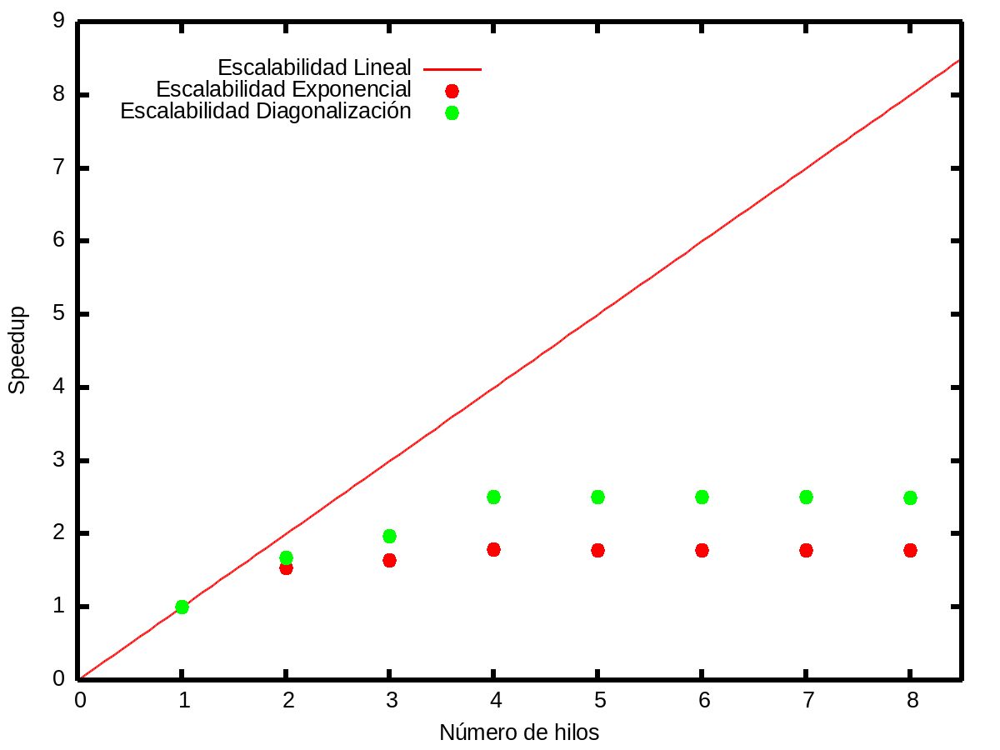

# Resultados varios
Con el código del proyecto se llevaron a cabo diversas pruebas de las que se obtuvieron los siguientes gráficos para análisis:

## Tiempo vs Espines
Tiempo de ejecución en función del número de espínes para ambos métodos

## Aceleración vs Hilos (Métodos)
Aceleración en función del número de hilos para ambos métodos

## Aceleración vs Hilos (Exponencial)
Aceleración en función del número de hilos para ambas partes de la evaluación Exponencial

